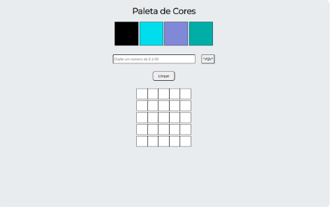

## Boas vindas ao repositório do projeto Arte com Pixels!

Esse projeto foi desenvolvido durante o curso de Desenvolvimento Web, na Trybe.

---

## Sumário

- [Habilidades](#habilidades)

- [O que foi desenvolvido](#o-que-foi-desenvolvido)

- [Data de desenvolvimento do projeto](#data-de-desenvolvimento-do-projeto)

- [Instruções para clonar o projeto](#instruções-para-clonar-o-projeto)

- [Resultado](#resultado)

- [Funcionalidades](#funcionalidades)

  

---

## Habilidades

- Manipular o DOM

- Manipular o Javascript

  

---

## O que foi desenvolvido

- Foi implementado uma página web, contendo uma paleta de cores funcional, que poderá ser utilizada para criar desenhos em pixels.

- Foi utilizado`javascript`, `css` e `html`.

  

---

## Data de Desenvolvimento do Projeto

- Agosto / 2021.

  

---

## Instruções para clonar o projeto:

1. Clone o repositório

  * `git clone git@github.com:Fernanda9421/pixels-art.git`
  * Entre na pasta do repositório que você acabou de clonar:
    * `cd pixels-art`

2. Você encontrará os arquivos:
   - `index.html`
   - `style.css`
   - `script.js`

## Resultado:

Após clonar o projeto, o resultado no Browser será semelhante à esta imagem

---

## Funcionalidades:

- Abaixo do título "Paleta de cores", há uma paleta contendo 4 cores distintas, sendo a primeira de cor preta.

- Ao recarregar a página, a paleta tem suas cores alteradas, exceto a primeira, que tem por padrão a cor preta.

- Inicialmente, a página contém um quadro de pixels, com 25 pixels.

- Ao clicar em uma das cores da paleta, a mesma fica selecionada, podendo ser utilizada para preencher os pixels no quadro.

  Caso nenhuma cor seja selecionada, a cor padrão é o preto.

- O botão "Limpar" faz com que o quadro de pixels seja limpo, e volte à cor de fundo padrão, branco.

- O quadro de pixels altera seu tamanho, de acordo com o que a pessoa usuária define. O input aceita números entre 5 e 50.

  Caso o usuário digite um número menor que 5, o valor 5 é considerado como padrão. Caso o usuário digite um valor maior que 50, o valor 50 é considerado como padrão.

  Para alterar o quadro, é só digitar um valor válido no input, e clicar no botão "VQV".

